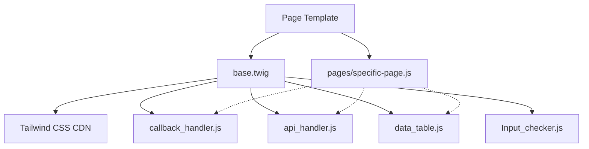

# JS RUNTIME ARCHITECTURE AUDIT

## 1️⃣ Architecture Summary
**Classification:** 🟡 Mixed Legacy + Modern (Global Scope)

The codebase operates on a **Non-Modular, Global Namespace** architecture. There is no build step (Webpack/Vite), no `package.json`, and no dependency management. JavaScript files are loaded via standard `<script>` tags in Twig templates, executing in the global scope.

- **Loading Model:** Direct `<script src="...">` injection.
- **Dependency Management:** Implicit ordering in `base.twig` and page templates.
- **Scope:** Global `window` (e.g., `window.ApiHandler`, `window.adminsCapabilities`).
- **Modernity:** Uses modern ES6+ syntax (async/await, const/let) but lacks module encapsulation.

## 2️⃣ Dependency Graph (High-Level)



## 3️⃣ Loading Model Description

1.  **Core Libraries:** Loaded in `app/Modules/AdminKernel/Templates/layouts/base.twig` or specific page templates.
    - `callback_handler.js`
    - `Input_checker.js`
    - `data_table.js`
    - `api_handler.js` (Loaded on demand in specific pages, e.g., `app_settings.list.twig`)

2.  **Page Logic:** Loaded at the bottom of page templates (e.g., `admins.twig` loads `pages/admins-list.js`).

3.  **Capabilities:** Injected as global JS objects (`window.adminsCapabilities`) directly in Twig templates before external scripts run.

## 4️⃣ API Handler Usage

| File | Handler Used | Notes |
| :--- | :--- | :--- |
| `app_settings_list.js` | `ApiHandler` | Modern implementation. |
| `permission-details-admins.js` | `callback_handler.js` | Legacy callback pattern. |
| `permission-details-roles.js` | `callback_handler.js` | Legacy callback pattern. |
| `admins-list.js` | `data_table.js` | Uses generic table fetcher. |
| `admin_emails.js` | `fetch()` | **Manual Implementation** |
| `admins_create.js` | `fetch()` | **Manual Implementation** |
| `permissions.js` | `fetch()` | **Manual Implementation** |
| `roles-create-rename-toggle.js` | `fetch()` | **Manual Implementation** |
| `sessions.js` | `fetch()` | **Manual Implementation** |

**Observation:** The majority of critical logic (Admins, Roles, Permissions) bypasses central handlers and uses manual `fetch()` calls.

## 5️⃣ Step-Up Detection Pattern

**Critical Risk Area:**
The application relies on **decentralized, manual detection** of the Step-Up requirement.

**Pattern Found:**
```javascript
if (response.status === 403) {
    const data = await response.json();
    if (data && data.code === 'STEP_UP_REQUIRED') {
        // Redirect logic
    }
}
```

**Locations:**
- `role-details-permissions.js`
- `roles-metadata.js`
- `permissions.js`
- `roles-create-rename-toggle.js` (3 occurrences)
- `role-details-admins.js`
- `admin-permissions-direct.js` (4 occurrences)
- `admin_emails.js` (2 occurrences)
- `admins_create.js`

**Impact:** Any change to the error response structure (e.g., nesting `code` inside `error`) will **break 2FA enforcement** across the entire admin panel.

## 6️⃣ Error Handling Assumptions

The codebase assumes **multiple conflicting error shapes**:

1.  **Unified (ApiHandler):** Expects `{ error: { message: "...", fields: {...} } }` or `{ message: "..." }`.
2.  **Legacy (CallbackHandler):** Expects `{ data: { response: <int> } }`.
3.  **Manual (Page Scripts):**
    - Checks `response.status` (403, 409).
    - Expects `data.code` (Step-Up).
    - Expects `data.message` (Error text).
    - Expects `data.error` (Error text).

## 7️⃣ Risk Areas

1.  **Step-Up Fragility (High):** Hardcoded checks for `data.code` at the root level will fail if the API standardizes on `{ error: { code: ... } }`.
2.  **Handler Fragmentation (Medium):** Simultaneous use of `ApiHandler`, `callback_handler`, and raw `fetch` creates inconsistent user experiences (different alerts, different redirect behaviors).
3.  **Global Namespace Pollution (Low):** variables like `tableData`, `headers` in `data_table.js` are global, potentially causing conflicts if multiple tables exist on one page (though currently unlikely due to architecture).

## 8️⃣ Refactor Readiness Score: 30%

The system is **poorly prepared** for a backend error normalization refactor.

- **Blocker:** 8+ files manually check `data.code` for Step-Up.
- **Blocker:** Legacy `callback_handler` expects a radically different JSON structure.
- **Blocker:** Most pages implement their own `fetch` error handling logic instead of using a central adapter.

**Recommendation:**
Before changing the backend error format, a **Frontend Standardization Layer** must be introduced to intercept these legacy patterns and map the new backend format to the expected legacy shapes (or update the JS to match).
