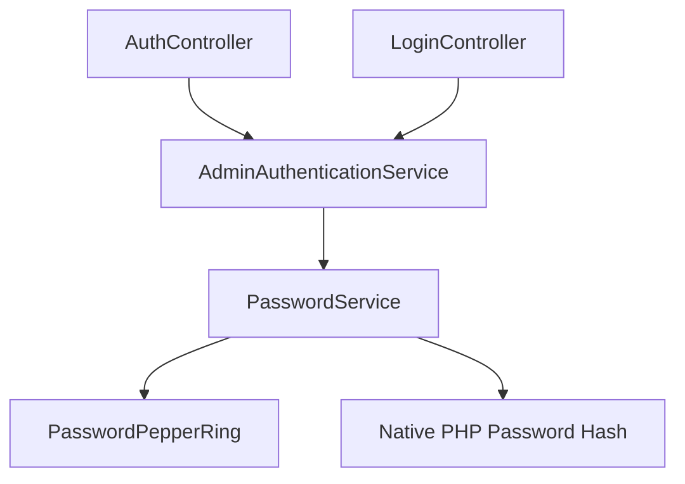

# Password Layer Consolidation Review

## 1. Executive Summary
**DECISION: C) CONSOLIDATE INTO DOMAIN**

The review confirms that `App\Domain\Service\PasswordService` is the **sole canonical and compliant authority** for password operations. It fully implements the architecture-locked "Pepper Ring" logic.

- The **Module layer** (`App\Modules\Crypto\Password`) is **legacy/non-compliant** because it lacks Pepper Ring support (single pepper only) and deterministic verification against stored pepper IDs.
- The **App/Infra layer** (`PasswordCryptoService`) is a **compliant but unused wrapper**. It delegates strictly to `PasswordService` but is not consumed by any part of the application.

Consolidating into the Domain (removing the unused wrappers and legacy module) is the only path that respects the "LOCKED" architectural constraints while eliminating redundancy.

## 2. Current Runtime Authority Chain

The application runtime **exclusively** relies on the Domain Service:

The `PasswordCryptoService` is wired in `Container.php` but **never injected** or used by any controller or service. The `PasswordHasher` (Module) is neither wired nor used.

## 3. Side-by-Side Comparison

| Feature | **App/Infra** (`PasswordCryptoService`) | **Module** (`PasswordHasher`) | **Domain** (`PasswordService`) |
| :--- | :--- | :--- | :--- |
| **Status** | Unused Wrapper | Dead / Legacy | **CANONICAL / ACTIVE** |
| **Pepper Ring Support** | ✅ Yes (Delegates) | ❌ **No** (Single Pepper) | ✅ **Yes** (Native) |
| **Upgrade-on-Login** | ❌ No logic (Delegates) | ❌ Not implemented | ✅ **Yes** |
| **Argon2id Policy** | ✅ Env-based | ✅ DTO-based | ✅ Env-based |
| **Return Type** | `PasswordHashDTO` | `string` (raw) | `array` (hash + id) |
| **Compliance** | ✅ Compliant | ❌ **Violation** | ✅ **Standard** |

**Key Risk:** Adopting the Module (`PasswordHasher`) would **violate** the LOCKED Pepper Ring architecture because it assumes a single global pepper and cannot verify hashes created with rotated/older peppers.

## 4. Decision Rationale

**Decision: C) CONSOLIDATE INTO DOMAIN**

We reject **Option B (Module)** because the module implementation is functionally inferior and architecturally non-compliant. Updating it to match the Domain service would require a rewrite, which contradicts the "Review Only" scope and adds unnecessary complexity.

We reject **Option A (Keep As-Is)** because `PasswordCryptoService` provides no value (it is unused) and `PasswordHasher` is dead code. Keeping them creates confusion about which class is authoritative.

**Option C** is the correct choice because:
1.  `PasswordService` is already the established, working, and secure standard.
2.  It removes `PasswordCryptoService` (unused code).
3.  It removes `PasswordHasher` (legacy/dead code).
4.  It removes duplicate DTOs (`PasswordHashDTO`, `ArgonPolicyDTO`).
5.  It enforces the "Single Source of Truth" principle.

## 5. "If We Change" Checklist

To execute this consolidation (in a future task):

1.  **Remove Files**:
    -   `app/Modules/Crypto/Password/` (Entire directory)
    -   `app/Infrastructure/Crypto/PasswordCryptoService.php`
    -   `app/Application/Crypto/PasswordCryptoServiceInterface.php`
    -   `app/Application/Crypto/DTO/PasswordHashDTO.php`
2.  **Update Container**:
    -   Remove `PasswordCryptoServiceInterface` binding from `app/Bootstrap/Container.php`.
    -   (Note: `PasswordCryptoService` was not injected anywhere, so no other container changes are needed).
3.  **Verify**:
    -   Run `phpunit` to ensure no hidden dependencies.
    -   Grep for `PasswordHashDTO` and `PasswordHasher` to ensure zero remaining references.

## 6. Closure Status Statement

This recommendation **DOES NOT** affect the crypto/password closure status adversely. In fact, it **reinforces** the closure by removing non-compliant legacy code that could be mistaken for a valid implementation. The policy remains strictly "Argon2id + Pepper Ring" as implemented by `PasswordService`.
